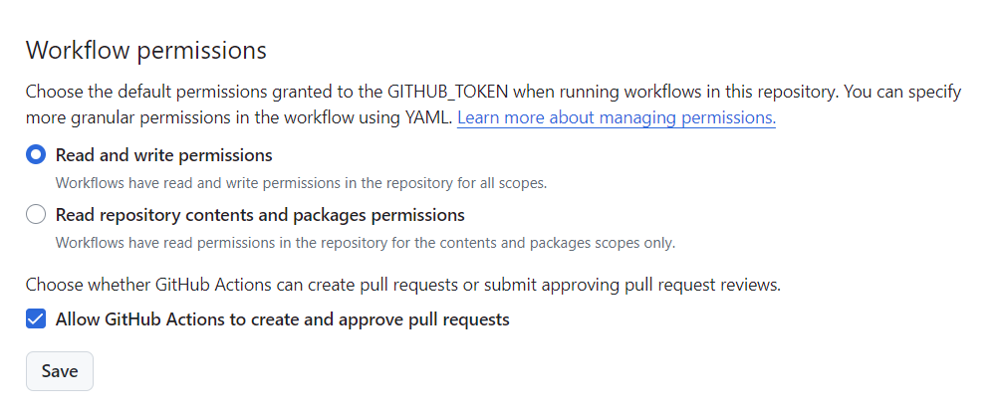
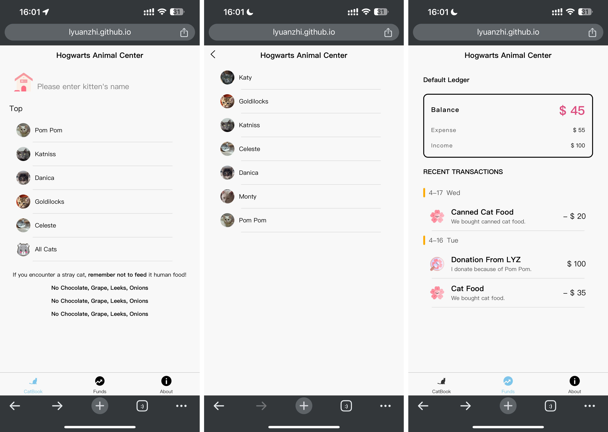
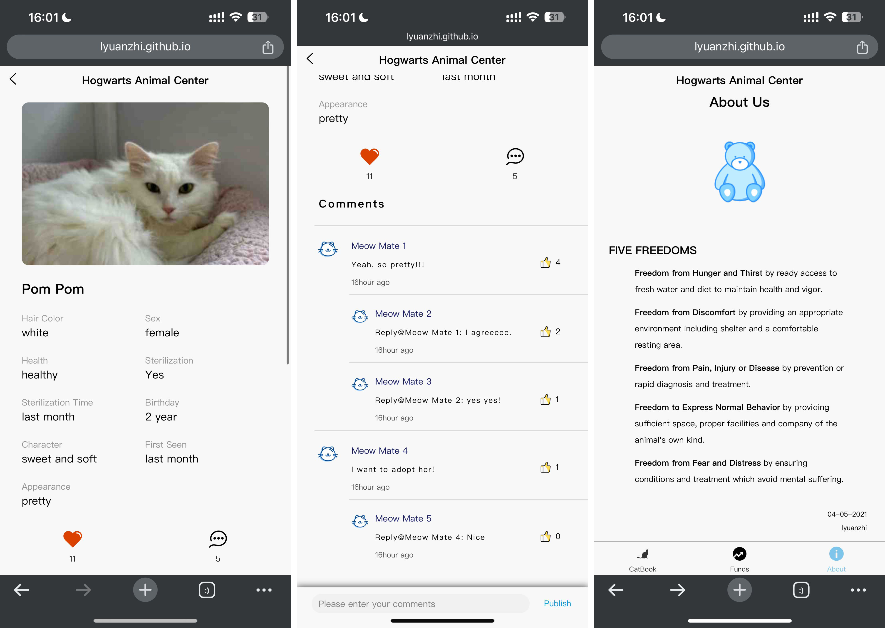

# KittyBook
A mobile website for cat adoption organizations.

## Demo
[Here](https://lyuanzhi.github.io/KittyBook)
##### Note: Please open the link with your mobile phone for the best experience.

## Story
I am a devoted cat lover, and I created this website to provide a platform for cat adoption organizations to showcase their cats. I've named the site KittyBook, envisioning it as a book that chronicles the lives of these delightful felines.

## Tech Stack
1. vue
2. Spring Boot
3. MySQL

## Deploy
### Front-end: ```GitHub Pages```
1. packaging the application locally, and get the folder ```unpackage```
2. setup workflows
```
name: Deploy uni-app to GitHub Pages

on:
  push:
    branches:
      - main

jobs:
  build-and-deploy:
    runs-on: ubuntu-latest

    steps:
    - name: Checkout
      uses: actions/checkout@v2

    - name: Deploy to GitHub Pages
      uses: peaceiris/actions-gh-pages@v4
      with:
        github_token: ${{ secrets.GITHUB_TOKEN }}
        publish_dir: ./kittybook-cli/unpackage/dist/build/h5
```

#### Deploy Issues and Solutions
1. The workflow fails to create a new branch: ```lack of access permission```

2. When deploying a Vue application in GitHub Pages, the path used to access resources in the bundled files does not match the path used by GitHub Pages to access these resources. For example,\
```Path By bundled files (actual): https://lyuanzhi.github.io/static/about.png```\
```Path By GitHub Pages (expected): https://lyuanzhi.github.io/KittyBook/static/about.png```\
The solution is to replace all ```static/``` in the bundled files to ```KittyBook/static```.

### Back-end: ```Google Cloud```
1. upload kitty.war
2. run nohup java -jar kitty.war &
3. check using lsof -i:8084

## Demo Screenshots


